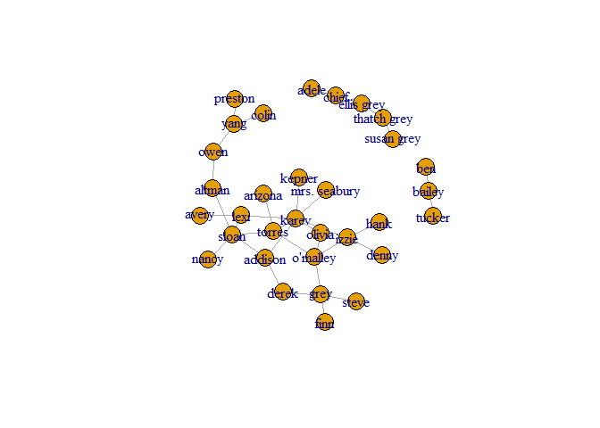
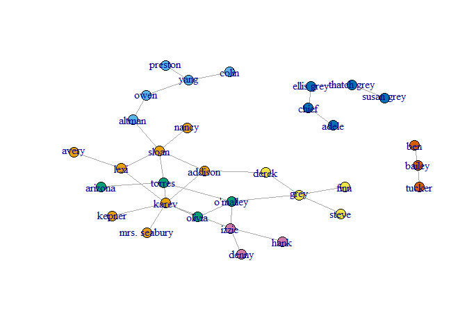
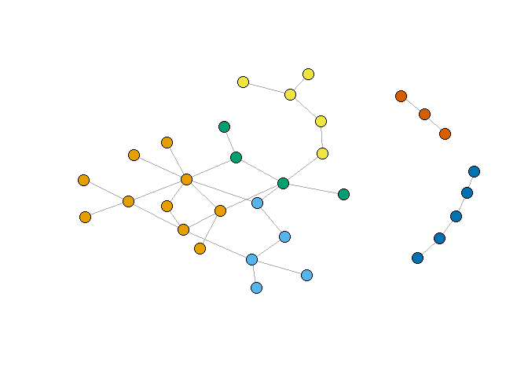

Assignment3
================
Ohad Dali
December 25, 2017

This repository included the R markdown: 1. Report.rmd - R markdown source file of this report. 2. ga\_edgelist.csv - rey Anatomy network of romance data file. 3. Report\_files - The png file for this report.

Assignment 3 - Task 1
=====================

Network Analysis of Grey Anatomy network of romance
---------------------------------------------------

### a. Centrality

Let's load the Grey Anatomy network of romance and plot the graph

``` r
library(igraph)
```

    ## Warning: package 'igraph' was built under R version 3.4.3

    ## 
    ## Attaching package: 'igraph'

    ## The following objects are masked from 'package:stats':
    ## 
    ##     decompose, spectrum

    ## The following object is masked from 'package:base':
    ## 
    ##     union

``` r
ga.data <- read.csv('ga_edgelist.csv', header = TRUE , stringsAsFactors = FALSE)
g <- graph.data.frame(ga.data,directed = F)
plot(g)
```



Now let's focus on the big component of the graph.

``` r
g_ <- delete.vertices(g, c('adele','chief','susan grey','thatch grey','ellis grey','tucker','bailey','ben'))
plot(g_)
```


#### i. By Betweeneess

We calcualte the betweeneess of each node in the new graph, and get the node with the highest betweeneess.

``` r
bet<-betweenness(g_)
bet[which.max(bet)]
```

    ##    sloan 
    ## 115.3667

Like we can see , Sloan is the actor with the highest betweeneess(115.3667)

#### ii. By Closeness

In the same way as before, we calculates the closeness of each node and get the maximum.

``` r
clo <- closeness(g_)
clo[which.max(clo)]
```

    ##     torres 
    ## 0.01754386

We can see that Torres has closeness of 0.01754386, which it the highest in the graph.

#### iii. By Eigenvector

``` r
eig <- eigen_centrality(g_)
eig$vector[which.max(eig$vector)]
```

    ## karev 
    ##     1

Karev is the actor with the highest value of eigenvector.

### b. Community Detection.

#### Girvan-Newman community detection

We will work on the whole network.

``` r
plot(g)
```


This is Top-Down Algorithm, in each round it caluclates the betweenness of each edge and remove the edges with the highest value, until there are zero edges left.

``` r
gc <- edge.betweenness.community(g)
```

We can see which actor belong to which community

``` r
memb <- membership(gc)
memb
```

    ##         lexi         owen        sloan       torres        derek 
    ##            1            2            1            3            4 
    ##        karev     o'malley         yang         grey        chief 
    ##            1            3            2            4            5 
    ##   ellis grey   susan grey       bailey        izzie       altman 
    ##            5            5            6            7            2 
    ##      arizona        colin      preston       kepner      addison 
    ##            3            2            2            1            1 
    ##        nancy       olivia mrs. seabury        adele  thatch grey 
    ##            1            3            1            5            5 
    ##       tucker         hank        denny         finn        steve 
    ##            6            7            7            4            4 
    ##          ben        avery 
    ##            6            1

Plot the graph with an unique color for each community.

``` r
plot(g, vertex.size=6, #vertex.label=NA,
     vertex.color=memb, asp=FALSE)
```



This algorithm return **7** Communities.

``` r
length(unique(memb))
```

    ## [1] 7

And the size of each community:

``` r
a <- as.data.frame(table(memb))
colnames(a) <- c("comm ID","Size")
a
```

    ##   comm ID Size
    ## 1       1    8
    ## 2       2    5
    ## 3       3    4
    ## 4       4    4
    ## 5       5    5
    ## 6       6    3
    ## 7       7    3

The modularity for each phase of this algorithm.

``` r
gc$modularity
```

    ##  [1] -0.04584775 -0.01773356  0.01081315  0.03849481  0.06617647
    ##  [6]  0.09472318  0.12326990  0.14965398  0.17560554  0.20285467
    ## [11]  0.23096886  0.25865052  0.28633218  0.31358131  0.34083045
    ## [16]  0.36894464  0.39576125  0.41479239  0.44247405  0.46712803
    ## [21]  0.49134948  0.50778547  0.52681661  0.54974048  0.57050173
    ## [26]  0.57742215  0.56098616  0.53416955  0.45804498  0.30449827

The best modularity score

``` r
max(gc$modularity)
```

    ## [1] 0.5774221

The phash (partition) with the best score

``` r
which.max(gc$modularity)
```

    ## [1] 26

#### Fastgreedy algorithm community detection

First we need to simplify the graph, because it only works with graphs with no self loops.

``` r
g <- simplify(g)
```

This is bottom-up algorithm. Let's get the communities

``` r
gc2 <- fastgreedy.community(g)
```

Let's plot the graph, now without labels

``` r
plot(g,  vertex.size=6, vertex.label=NA,
     vertex.color=membership(gc2), asp=FALSE)
```



This algorithm return **6** Communities.

``` r
memb <- membership(gc2)
length(unique(memb))
```

    ## [1] 6

And the size of each community:

``` r
a <- as.data.frame(table(memb))
colnames(a) <- c("comm ID","Size")
a
```

    ##   comm ID Size
    ## 1       1   10
    ## 2       2    5
    ## 3       3    4
    ## 4       4    5
    ## 5       5    5
    ## 6       6    3

The modularity for each phase of this algorithm.

``` r
gc2$modularity
```

    ##  [1] -0.04584775 -0.01730104  0.01124567  0.03979239  0.06790657
    ##  [6]  0.09602076  0.12413495  0.15181661  0.17949827  0.20717993
    ## [11]  0.23486159  0.26254325  0.28979239  0.31704152  0.34429066
    ## [16]  0.37110727  0.39792388  0.42430796  0.45025952  0.47621107
    ## [21]  0.49913495  0.51989619  0.53892734  0.55536332  0.57179931
    ## [26]  0.58780277  0.59472318  0.58520761  0.52422145  0.30449827

The best modularity score

``` r
max(gc2$modularity)
```

    ## [1] 0.5947232

The phash (partition) with the best score

``` r
which.max(gc2$modularity)
```

    ## [1] 27
