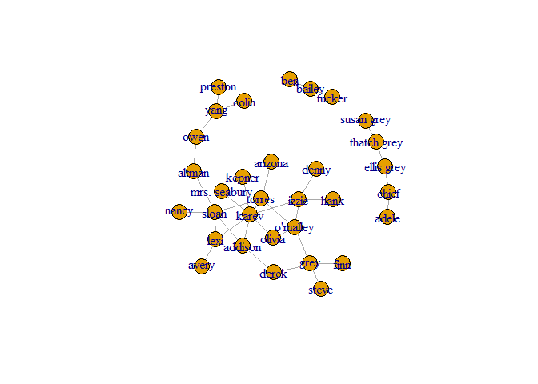
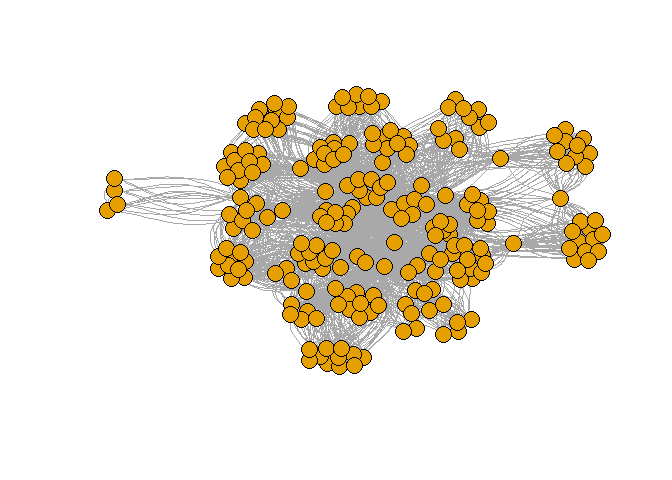

Assignment3
================
Matan Tsubery 316263938 Ohad Dali 316452929
December 25, 2017

This repository included the R markdown: 1. Report.rmd - R markdown source file of this report. 2. ga\_edgelist.csv - rey Anatomy network of romance data file. 3. Report\_files - The png file for this report.

Assignment 3 - Task 1
=====================

Network Analysis of Grey Anatomy network of romance
---------------------------------------------------

### a. Centrality

Let's load the Grey Anatomy network of romance and plot the graph

``` r
library(igraph)
```

    ## Warning: package 'igraph' was built under R version 3.4.3

    ## 
    ## Attaching package: 'igraph'

    ## The following objects are masked from 'package:stats':
    ## 
    ##     decompose, spectrum

    ## The following object is masked from 'package:base':
    ## 
    ##     union

``` r
ga.data <- read.csv('ga_edgelist.csv', header = TRUE , stringsAsFactors = FALSE)
g <- graph.data.frame(ga.data,directed = F)
plot(g)
```


Now let's focus on the big component of the graph.

``` r
g_ <- delete.vertices(g, c('adele','chief','susan grey','thatch grey','ellis grey','tucker','bailey','ben'))
plot(g_)
```


#### i. By Betweeneess

We calcualte the betweeneess of each node in the new graph, and get the node with the highest betweeneess.

``` r
bet<-betweenness(g_)
bet[which.max(bet)]
```

    ##    sloan 
    ## 115.3667

Like we can see , Sloan is the actor with the highest betweeneess(115.3667)

#### ii. By Closeness

In the same way as before, we calculates the closeness of each node and get the maximum.

``` r
clo <- closeness(g_)
clo[which.max(clo)]
```

    ##     torres 
    ## 0.01754386

We can see that Torres has closeness of 0.01754386, which it the highest in the graph.

#### iii. By Eigenvector

``` r
eig <- eigen_centrality(g_)
eig$vector[which.max(eig$vector)]
```

    ## karev 
    ##     1

Karev is the actor with the highest value of eigenvector.

### b. Community Detection.

#### Girvan-Newman community detection

We will work on the whole network.

``` r
plot(g)
```



This is Top-Down Algorithm, in each round it caluclates the betweenness of each edge and remove the edges with the highest value, until there are zero edges left.

``` r
gc <- edge.betweenness.community(g)
```

We can see which actor belong to which community

``` r
memb <- membership(gc)
memb
```

    ##         lexi         owen        sloan       torres        derek 
    ##            1            2            1            3            4 
    ##        karev     o'malley         yang         grey        chief 
    ##            1            3            2            4            5 
    ##   ellis grey   susan grey       bailey        izzie       altman 
    ##            5            5            6            7            2 
    ##      arizona        colin      preston       kepner      addison 
    ##            3            2            2            1            1 
    ##        nancy       olivia mrs. seabury        adele  thatch grey 
    ##            1            3            1            5            5 
    ##       tucker         hank        denny         finn        steve 
    ##            6            7            7            4            4 
    ##          ben        avery 
    ##            6            1

Plot the graph with an unique color for each community.

``` r
plot(g, vertex.size=6, #vertex.label=NA,
     vertex.color=memb, asp=FALSE)
```


This algorithm return **7** Communities.

``` r
length(unique(memb))
```

    ## [1] 7

And the size of each community:

``` r
a <- as.data.frame(table(memb))
colnames(a) <- c("comm ID","Size")
a
```

    ##   comm ID Size
    ## 1       1    8
    ## 2       2    5
    ## 3       3    4
    ## 4       4    4
    ## 5       5    5
    ## 6       6    3
    ## 7       7    3

The modularity for each phase of this algorithm.

``` r
gc$modularity
```

    ##  [1] -0.04584775 -0.01773356  0.01081315  0.03849481  0.06617647
    ##  [6]  0.09472318  0.12326990  0.14965398  0.17560554  0.20285467
    ## [11]  0.23096886  0.25865052  0.28633218  0.31358131  0.34083045
    ## [16]  0.36894464  0.39576125  0.41479239  0.44247405  0.46712803
    ## [21]  0.49134948  0.50778547  0.52681661  0.54974048  0.57050173
    ## [26]  0.57742215  0.56098616  0.53416955  0.45804498  0.30449827

The best modularity score

``` r
max(gc$modularity)
```

    ## [1] 0.5774221

The phash (partition) with the best score

``` r
which.max(gc$modularity)
```

    ## [1] 26

#### Fastgreedy algorithm community detection

First we need to simplify the graph, because it only works with graphs with no self loops.

``` r
g <- simplify(g)
```

This is bottom-up algorithm. Let's get the communities

``` r
gc2 <- fastgreedy.community(g)
```

Let's plot the graph, now without labels

``` r
plot(g,  vertex.size=6, vertex.label=NA,
     vertex.color=membership(gc2), asp=FALSE)
```


This algorithm return **6** Communities.

``` r
memb <- membership(gc2)
length(unique(memb))
```

    ## [1] 6

And the size of each community:

``` r
a <- as.data.frame(table(memb))
colnames(a) <- c("comm ID","Size")
a
```

    ##   comm ID Size
    ## 1       1   10
    ## 2       2    5
    ## 3       3    4
    ## 4       4    5
    ## 5       5    5
    ## 6       6    3

The modularity for each phase of this algorithm.

``` r
gc2$modularity
```

    ##  [1] -0.04584775 -0.01730104  0.01124567  0.03979239  0.06790657
    ##  [6]  0.09602076  0.12413495  0.15181661  0.17949827  0.20717993
    ## [11]  0.23486159  0.26254325  0.28979239  0.31704152  0.34429066
    ## [16]  0.37110727  0.39792388  0.42430796  0.45025952  0.47621107
    ## [21]  0.49913495  0.51989619  0.53892734  0.55536332  0.57179931
    ## [26]  0.58780277  0.59472318  0.58520761  0.52422145  0.30449827

The best modularity score

``` r
max(gc2$modularity)
```

    ## [1] 0.5947232

The phash (partition) with the best score

``` r
which.max(gc2$modularity)
```

    ## [1] 27

Assignment 3 - Task 2
=====================

Network Analysis of tweets
--------------------------

Loading the relvant packages

``` r
library(twitteR)
```

    ## Warning: package 'twitteR' was built under R version 3.4.3

``` r
library(tm)
```

    ## Warning: package 'tm' was built under R version 3.4.3

    ## Loading required package: NLP

``` r
library(httr)
```

    ## Warning: package 'httr' was built under R version 3.4.3

    ## 
    ## Attaching package: 'httr'

    ## The following object is masked from 'package:NLP':
    ## 
    ##     content

``` r
library(igraph)
```

``` r
source("twitterAuth.R")
options(httr_oauth_cache=F)
setup_twitter_oauth(consumer_key, consumer_secret, access_token, access_secret)
```

    ## [1] "Using direct authentication"

Prince Harry wedding is now all over bbc website, let's have a look at some tweets about it. Search the latest 30 tweets that containes 'prince harry'

``` r
searchRes <- searchTwitter("prince harry", n=30 , lang="en")
```

It will be easy to work with a dataFrame then a list.

``` r
tweetsDf <- twListToDF(searchRes)
```

Now we will remove all of the common words in english, using the stopwords function.

``` r
tweetsText <- tweetsDf$text
tweetsText <- lapply(tweetsText, function(str) removeWords(str,stopwords("english")))
```

Each node in the graph will be a word in a tweet. Given w1,w2 node in the graph, (w1,w2) belong to the the graph iff w1 and w2 in the same tweet.

``` r
w1edge <- c()
w2edge <- c()
tweets <- lapply(tweetsText, function(str) strsplit(str[[1]]," "))
tweets <- lapply(tweets, unlist)
tweets <- lapply(tweets, function(x) x[!x==""])
tweets <- lapply(tweets, function(x) x[!x=="RT"])
tweets <- lapply(tweets, function(lst) Filter(function(x) !grepl("http",x),lst))
for(tweet in tweets)
{
  tweet <- unique(tweet)
  for(word1 in tweet)
  {
    for(word2 in tweet)
    {
      if(word1!=word2)
      {
        w1edge <- c(w1edge,word1)
        w2edge <- c(w2edge,word2)
      }
    }
  }
}
```

Making the graph..

``` r
res <- cbind(from = w1edge , to = w2edge)
write.csv(res , file = "tweets.csv" , row.names = FALSE)
ga.data <- read.csv('tweets.csv', header = T)
g <- graph.data.frame(ga.data,directed = F)
plot(g, vertex.size=7, vertex.label=NA, asp=FALSE)
```



### a. Now we will calculate Centrality :

#### i. By Betweeneess

We calcualte the betweeneess of each node in the new graph, and get the node with the highest betweeneess.

``` r
bet<-betweenness(g)
bet[which.max(bet)]
```

    ##   Prince 
    ## 14441.43

#### ii. By Closeness

In the same way as before, we calculates the closeness of each node and get the maximum.

``` r
clo <- closeness(g)
clo[which.max(clo)]
```

    ##      Prince 
    ## 0.003546099

#### iii. By Eigenvector

``` r
eig <- eigen_centrality(g)
eig$vector[which.max(eig$vector)]
```

    ## Prince 
    ##      1

### b. Community Detection.

#### Girvan-Newman community detection

This is Top-Down Algorithm, in each round it caluclates the betweenness of each edge and remove the edges with the highest value, until there are zero edges left.

``` r
gc <- edge.betweenness.community(g)
```

Plot the graph with an unique color for each community.

``` r
memb <- membership(gc)
plot(g, vertex.size=6, vertex.label=NA,
     vertex.color=memb, asp=FALSE)
```


The number of communities

``` r
length(unique(memb))
```

    ## [1] 21

And the size of each community:

``` r
a <- as.data.frame(table(memb))
colnames(a) <- c("comm ID","Size")
a
```

    ##    comm ID Size
    ## 1        1   12
    ## 2        2   28
    ## 3        3    8
    ## 4        4   21
    ## 5        5   21
    ## 6        6   15
    ## 7        7   13
    ## 8        8    4
    ## 9        9    8
    ## 10      10    9
    ## 11      11    3
    ## 12      12   11
    ## 13      13    9
    ## 14      14   13
    ## 15      15   11
    ## 16      16    9
    ## 17      17    7
    ## 18      18   14
    ## 19      19    5
    ## 20      20   12
    ## 21      21    3

The modularity for each phase of this algorithm.

``` r
gc$modularity
```

    ##   [1] -0.0104827878 -0.0079375787 -0.0064584158 -0.0051023898 -0.0034712061
    ##   [6] -0.0020684337  0.0003821424  0.0024119058  0.0031913927  0.0047734547
    ##  [11]  0.0073030817  0.0106300580  0.0147543837  0.0196760588  0.0253950832
    ##  [16]  0.0319114570  0.0392251801  0.0399537401  0.0407545099  0.0423811330
    ##  [21]  0.0448336094  0.0481119390  0.0522161220  0.0571461582  0.0629020476
    ##  [26]  0.0643698090  0.0666546824  0.0697566678  0.0736757654  0.0784119750
    ##  [31]  0.0839652967  0.0903357304  0.0975232763  0.1055279342  0.1143497042
    ##  [36]  0.1163738618  0.1191953688  0.1228142252  0.1272304309  0.1324439860
    ##  [41]  0.1384548905  0.1452631443  0.1528687475  0.1588967543  0.1680554405
    ##  [46]  0.1763688908  0.1767807723  0.1776170770  0.1788778049  0.1805629560
    ##  [51]  0.1826725304  0.1852065279  0.1881649487  0.1885962129  0.1894587412
    ##  [56]  0.1898786037  0.1907183289  0.1919779167  0.1936573670  0.1957566800
    ##  [61]  0.1982758555  0.2012148936  0.2045737943  0.2083525576  0.2125511835
    ##  [66]  0.2171696720  0.2175919099  0.2184363857  0.2197030995  0.2213464449
    ##  [71]  0.2234462329  0.2259682588  0.2289125226  0.2293407464  0.2301971938
    ##  [76]  0.2314639076  0.2331708167  0.2335972352  0.2344500722  0.2357293276
    ##  [81]  0.2361537508  0.2370025973  0.2382758669  0.2399735598  0.2420956758
    ##  [86]  0.2446422151  0.2476131776  0.2487755671  0.2503464175  0.2523257290
    ##  [91]  0.2547135015  0.2575097350  0.2607144296  0.2641998877  0.2682554239
    ##  [96]  0.2731153405  0.2735417590  0.2743945960  0.2756738514  0.2773795254
    ## [101]  0.2795116178  0.2820701287  0.2824983525  0.2833547999  0.2846394711
    ## [106]  0.2863523661  0.2884934848  0.2910217815  0.2940125068  0.2944389252
    ## [111]  0.2952917622  0.2965710177  0.2982766916  0.3004087841  0.3029672950
    ## [116]  0.3059522244  0.3093635723  0.3097879955  0.3106368419  0.3119101116
    ## [121]  0.3136078044  0.3157299205  0.3182764598  0.3212474223  0.3246428080
    ## [126]  0.3284626169  0.3327068491  0.3334669533  0.3346443548  0.3362390535
    ## [131]  0.3382510495  0.3406803427  0.3435269332  0.3467908208  0.3504720057
    ## [136]  0.3545704879  0.3590862673  0.3640193439  0.3644366411  0.3652712356
    ## [141]  0.3665231273  0.3681763541  0.3702588497  0.3727586426  0.3756757327
    ## [146]  0.3790101200  0.3826147244  0.3867677441  0.3871850413  0.3880196358
    ## [151]  0.3892715275  0.3909407164  0.3930272026  0.3955309860  0.3984520667
    ## [156]  0.4017904446  0.4055461197  0.4097190921  0.4143093617  0.4193169285
    ## [161]  0.4197519932  0.4206221225  0.4210519615  0.4219116394  0.4232011563
    ## [166]  0.4236255795  0.4244744259  0.4257476956  0.4274453884  0.4295675045
    ## [171]  0.4321140438  0.4325256402  0.4333488331  0.4345836225  0.4362300083
    ## [176]  0.4382879906  0.4407575693  0.4436387445  0.4469315161  0.4506358842
    ## [181]  0.4547518488  0.4592794098  0.4642185672  0.4692926432  0.4750337106
    ## [186]  0.4754601291  0.4763129661  0.4775922215  0.4792978955  0.4814299879
    ## [191]  0.4839884989  0.4869734283  0.4873932909  0.4882330160  0.4894926038
    ## [196]  0.4911720542  0.4932713671  0.4957905426  0.4987295807  0.5020884815
    ## [201]  0.5058672448  0.5100658706  0.5141001240  0.5174069575  0.5214026356
    ## [206]  0.5258156109  0.5274081243  0.5318182492  0.5380175645  0.5394355390
    ## [211]  0.5412757514  0.5435382017  0.5462228899  0.5493298161  0.5522835812
    ## [216]  0.5568613091  0.5541101117  0.5483937477  0.5378447358  0.5323256188
    ## [221]  0.5331659140  0.5373806921  0.5275810480  0.5275339216  0.5223570415
    ## [226]  0.5217983649  0.5169891852  0.5169146950  0.5172923718  0.5078611882
    ## [231]  0.5012142665  0.2813658921  0.2477948425  0.1700844438  0.0026078227
    ## [236]  0.0000000000

The best modularity score

``` r
max(gc$modularity)
```

    ## [1] 0.5568613

The phash (partition) with the best score

``` r
which.max(gc$modularity)
```

    ## [1] 216

#### Fastgreedy algorithm community detection

First we need to simplify the graph, because it only works with graphs with no self loops.

``` r
g <- simplify(g)
```

This is bottom-up algorithm. Let's get the communities

``` r
gc2 <- fastgreedy.community(g)
```

Let's plot the graph, now without labels

``` r
plot(g,  vertex.size=6, vertex.label=NA,
     vertex.color=membership(gc2), asp=FALSE)
```


The number of Communities

``` r
memb <- membership(gc2)
length(unique(memb))
```

    ## [1] 9

And the size of each community:

``` r
a <- as.data.frame(table(memb))
colnames(a) <- c("comm ID","Size")
a
```

    ##   comm ID Size
    ## 1       1   26
    ## 2       2   38
    ## 3       3   24
    ## 4       4   13
    ## 5       5   12
    ## 6       6   11
    ## 7       7   28
    ## 8       8   31
    ## 9       9   53

The modularity for each phase of this algorithm.

``` r
gc2$modularity
```

    ##   [1] -8.685779e-03 -8.151166e-03 -7.081939e-03 -5.496192e-03 -4.967323e-03
    ##   [6] -3.909584e-03 -2.344085e-03 -3.110321e-04  1.934688e-03  3.068534e-03
    ##  [11]  4.334489e-03  6.094850e-03  8.349617e-03  1.109879e-02  1.434237e-02
    ##  [16]  1.808035e-02  2.210424e-02  2.658807e-02  3.136642e-02  3.639506e-02
    ##  [21]  4.142413e-02  4.671541e-02  5.211640e-02  5.486873e-02  5.694802e-02
    ##  [26]  5.896528e-02  6.131511e-02  6.416408e-02  6.751220e-02  7.135946e-02
    ##  [31]  7.570587e-02  8.055142e-02  8.589612e-02  9.087550e-02  9.636265e-02
    ##  [36]  1.020293e-01  1.035931e-01  1.056784e-01  1.082853e-01  1.114137e-01
    ##  [41]  1.126854e-01  1.144723e-01  1.167745e-01  1.195918e-01  1.229244e-01
    ##  [46]  1.260488e-01  1.291233e-01  1.326319e-01  1.334873e-01  1.340703e-01
    ##  [51]  1.351719e-01  1.367919e-01  1.389305e-01  1.415877e-01  1.447633e-01
    ##  [56]  1.484575e-01  1.489842e-01  1.500377e-01  1.516178e-01  1.536925e-01
    ##  [61]  1.562640e-01  1.582310e-01  1.590431e-01  1.603794e-01  1.622400e-01
    ##  [66]  1.646249e-01  1.675340e-01  1.709674e-01  1.749251e-01  1.755799e-01
    ##  [71]  1.767532e-01  1.784451e-01  1.806555e-01  1.833844e-01  1.866319e-01
    ##  [76]  1.903979e-01  1.924461e-01  1.929704e-01  1.940190e-01  1.955918e-01
    ##  [81]  1.975855e-01  1.981070e-01  1.991501e-01  2.007148e-01  2.028010e-01
    ##  [86]  2.054087e-01  2.085380e-01  2.121888e-01  2.158901e-01  2.164117e-01
    ##  [91]  2.174548e-01  2.190194e-01  2.211056e-01  2.237133e-01  2.268426e-01
    ##  [96]  2.304934e-01  2.346658e-01  2.374754e-01  2.379970e-01  2.390401e-01
    ## [101]  2.406047e-01  2.426909e-01  2.452986e-01  2.484279e-01  2.519681e-01
    ## [106]  2.556412e-01  2.591763e-01  2.598983e-01  2.611356e-01  2.628880e-01
    ## [111]  2.651557e-01  2.679386e-01  2.712368e-01  2.750501e-01  2.788842e-01
    ## [116]  2.794027e-01  2.804398e-01  2.819954e-01  2.840695e-01  2.866622e-01
    ## [121]  2.897733e-01  2.934030e-01  2.975513e-01  3.022181e-01  3.074034e-01
    ## [126]  3.110222e-01  3.115407e-01  3.125778e-01  3.141333e-01  3.162075e-01
    ## [131]  3.188001e-01  3.219113e-01  3.255410e-01  3.266438e-01  3.271624e-01
    ## [136]  3.281994e-01  3.297550e-01  3.318292e-01  3.344218e-01  3.375330e-01
    ## [141]  3.410411e-01  3.415563e-01  3.425868e-01  3.441324e-01  3.461933e-01
    ## [146]  3.487695e-01  3.518609e-01  3.554674e-01  3.595893e-01  3.642263e-01
    ## [151]  3.691373e-01  3.696490e-01  3.706723e-01  3.722072e-01  3.742537e-01
    ## [156]  3.768119e-01  3.798817e-01  3.834632e-01  3.875563e-01  3.921610e-01
    ## [161]  3.972774e-01  3.977891e-01  3.988123e-01  4.003472e-01  4.023938e-01
    ## [166]  4.049520e-01  4.080218e-01  4.116033e-01  4.156964e-01  4.203011e-01
    ## [171]  4.254175e-01  4.310455e-01  4.315533e-01  4.325688e-01  4.340921e-01
    ## [176]  4.361231e-01  4.386619e-01  4.417085e-01  4.452628e-01  4.493249e-01
    ## [181]  4.538947e-01  4.589723e-01  4.642260e-01  4.647338e-01  4.657493e-01
    ## [186]  4.672726e-01  4.693036e-01  4.718424e-01  4.748890e-01  4.784433e-01
    ## [191]  4.825054e-01  4.870752e-01  4.921528e-01  4.977382e-01  5.038313e-01
    ## [196]  5.043391e-01  5.053546e-01  5.068779e-01  5.089089e-01  5.114477e-01
    ## [201]  5.144943e-01  5.180486e-01  5.221107e-01  5.264634e-01  5.286358e-01
    ## [206]  5.291435e-01  5.301591e-01  5.316823e-01  5.337134e-01  5.362522e-01
    ## [211]  5.392987e-01  5.428531e-01  5.464258e-01  5.495227e-01  5.500219e-01
    ## [216]  5.510202e-01  5.525176e-01  5.545142e-01  5.570099e-01  5.600048e-01
    ## [221]  5.634988e-01  5.674919e-01  5.719843e-01  5.769757e-01  5.824663e-01
    ## [226]  5.884560e-01  5.949449e-01  5.965612e-01  5.956404e-01  5.914324e-01
    ## [231]  5.813742e-01  5.679341e-01  5.459404e-01  5.060241e-01  3.709569e-01
    ## [236] -1.110223e-16

The best modularity score

``` r
max(gc2$modularity)
```

    ## [1] 0.5965612

The phash (partition) with the best score

``` r
which.max(gc2$modularity)
```

    ## [1] 228
