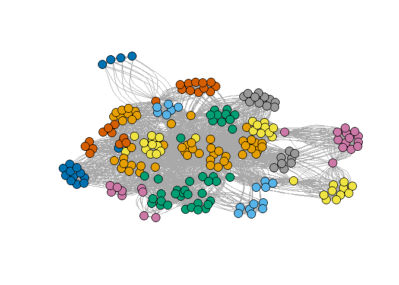

Assignment3
================
Matan Tsubery 316263938 Ohad Dali 316452929
December 25, 2017

This repository included the R markdown: 1. Report.rmd - R markdown source file of this report. 2. ga\_edgelist.csv - rey Anatomy network of romance data file. 3. Report\_files - The png file for this report.

Assignment 3 - Task 1
=====================

Network Analysis of Grey Anatomy network of romance
---------------------------------------------------

### a. Centrality

Let's load the Grey Anatomy network of romance and plot the graph

``` r
library(igraph)
```

    ## Warning: package 'igraph' was built under R version 3.4.3

    ## 
    ## Attaching package: 'igraph'

    ## The following objects are masked from 'package:stats':
    ## 
    ##     decompose, spectrum

    ## The following object is masked from 'package:base':
    ## 
    ##     union

``` r
ga.data <- read.csv('ga_edgelist.csv', header = TRUE , stringsAsFactors = FALSE)
g <- graph.data.frame(ga.data,directed = F)
plot(g)
```


Now let's focus on the big component of the graph.

``` r
g_ <- delete.vertices(g, c('adele','chief','susan grey','thatch grey','ellis grey','tucker','bailey','ben'))
plot(g_)
```


#### i. By Betweeneess

We calcualte the betweeneess of each node in the new graph, and get the node with the highest betweeneess.

``` r
bet<-betweenness(g_)
bet[which.max(bet)]
```

    ##    sloan 
    ## 115.3667

Like we can see , Sloan is the actor with the highest betweeneess(115.3667)

#### ii. By Closeness

In the same way as before, we calculates the closeness of each node and get the maximum.

``` r
clo <- closeness(g_)
clo[which.max(clo)]
```

    ##     torres 
    ## 0.01754386

We can see that Torres has closeness of 0.01754386, which it the highest in the graph.

#### iii. By Eigenvector

``` r
eig <- eigen_centrality(g_)
eig$vector[which.max(eig$vector)]
```

    ## karev 
    ##     1

Karev is the actor with the highest value of eigenvector.

### b. Community Detection.

#### Girvan-Newman community detection

We will work on the whole network.

``` r
plot(g)
```


This is Top-Down Algorithm, in each round it caluclates the betweenness of each edge and remove the edges with the highest value, until there are zero edges left.

``` r
gc <- edge.betweenness.community(g)
```

We can see which actor belong to which community

``` r
memb <- membership(gc)
memb
```

    ##         lexi         owen        sloan       torres        derek 
    ##            1            2            1            3            4 
    ##        karev     o'malley         yang         grey        chief 
    ##            1            3            2            4            5 
    ##   ellis grey   susan grey       bailey        izzie       altman 
    ##            5            5            6            7            2 
    ##      arizona        colin      preston       kepner      addison 
    ##            3            2            2            1            1 
    ##        nancy       olivia mrs. seabury        adele  thatch grey 
    ##            1            3            1            5            5 
    ##       tucker         hank        denny         finn        steve 
    ##            6            7            7            4            4 
    ##          ben        avery 
    ##            6            1

Plot the graph with an unique color for each community.

``` r
plot(g, vertex.size=6, #vertex.label=NA,
     vertex.color=memb, asp=FALSE)
```


This algorithm return **7** Communities.

``` r
length(unique(memb))
```

    ## [1] 7

And the size of each community:

``` r
a <- as.data.frame(table(memb))
colnames(a) <- c("comm ID","Size")
a
```

    ##   comm ID Size
    ## 1       1    8
    ## 2       2    5
    ## 3       3    4
    ## 4       4    4
    ## 5       5    5
    ## 6       6    3
    ## 7       7    3

The modularity for each phase of this algorithm.

``` r
gc$modularity
```

    ##  [1] -0.04584775 -0.01773356  0.01081315  0.03849481  0.06617647
    ##  [6]  0.09472318  0.12326990  0.14965398  0.17560554  0.20285467
    ## [11]  0.23096886  0.25865052  0.28633218  0.31358131  0.34083045
    ## [16]  0.36894464  0.39576125  0.41479239  0.44247405  0.46712803
    ## [21]  0.49134948  0.50778547  0.52681661  0.54974048  0.57050173
    ## [26]  0.57742215  0.56098616  0.53416955  0.45804498  0.30449827

The best modularity score

``` r
max(gc$modularity)
```

    ## [1] 0.5774221

The phash (partition) with the best score

``` r
which.max(gc$modularity)
```

    ## [1] 26

#### Fastgreedy algorithm community detection

First we need to simplify the graph, because it only works with graphs with no self loops.

``` r
g <- simplify(g)
```

This is bottom-up algorithm. Let's get the communities

``` r
gc2 <- fastgreedy.community(g)
```

Let's plot the graph, now without labels

``` r
plot(g,  vertex.size=6, vertex.label=NA,
     vertex.color=membership(gc2), asp=FALSE)
```


This algorithm return **6** Communities.

``` r
memb <- membership(gc2)
length(unique(memb))
```

    ## [1] 6

And the size of each community:

``` r
a <- as.data.frame(table(memb))
colnames(a) <- c("comm ID","Size")
a
```

    ##   comm ID Size
    ## 1       1   10
    ## 2       2    5
    ## 3       3    4
    ## 4       4    5
    ## 5       5    5
    ## 6       6    3

The modularity for each phase of this algorithm.

``` r
gc2$modularity
```

    ##  [1] -0.04584775 -0.01730104  0.01124567  0.03979239  0.06790657
    ##  [6]  0.09602076  0.12413495  0.15181661  0.17949827  0.20717993
    ## [11]  0.23486159  0.26254325  0.28979239  0.31704152  0.34429066
    ## [16]  0.37110727  0.39792388  0.42430796  0.45025952  0.47621107
    ## [21]  0.49913495  0.51989619  0.53892734  0.55536332  0.57179931
    ## [26]  0.58780277  0.59472318  0.58520761  0.52422145  0.30449827

The best modularity score

``` r
max(gc2$modularity)
```

    ## [1] 0.5947232

The phash (partition) with the best score

``` r
which.max(gc2$modularity)
```

    ## [1] 27

Assignment 3 - Task 2
=====================

Network Analysis of tweets
--------------------------

Loading the relvant packages

``` r
library(twitteR)
```

    ## Warning: package 'twitteR' was built under R version 3.4.3

``` r
library(tm)
```

    ## Warning: package 'tm' was built under R version 3.4.3

    ## Loading required package: NLP

``` r
library(httr)
```

    ## Warning: package 'httr' was built under R version 3.4.3

    ## 
    ## Attaching package: 'httr'

    ## The following object is masked from 'package:NLP':
    ## 
    ##     content

``` r
library(igraph)
```

``` r
source("twitterAuth.R")
options(httr_oauth_cache=F)
setup_twitter_oauth(consumer_key, consumer_secret, access_token, access_secret)
```

    ## [1] "Using direct authentication"

Prince Harry wedding is now all over bbc website, let's have a look at some tweets about it. Search the latest 30 tweets that containes 'prince harry'

``` r
searchRes <- searchTwitter("prince harry", n=30 , lang="en")
```

It will be easy to work with a dataFrame then a list.

``` r
tweetsDf <- twListToDF(searchRes)
```

Now we will remove all of the common words in english, using the stopwords function.

``` r
tweetsText <- tweetsDf$text
tweetsText <- lapply(tweetsText, function(str) removeWords(str,stopwords("english")))
```

Each node in the graph will be a word in a tweet. Given w1,w2 node in the graph, (w1,w2) belong to the the graph iff w1 and w2 in the same tweet.

``` r
w1edge <- c()
w2edge <- c()
tweets <- lapply(tweetsText, function(str) strsplit(str[[1]]," "))
tweets <- lapply(tweets, unlist)
tweets <- lapply(tweets, function(x) x[!x==""])
tweets <- lapply(tweets, function(x) x[!x=="RT"])
tweets <- lapply(tweets, function(lst) Filter(function(x) !grepl("http",x),lst))
for(tweet in tweets)
{
  tweet <- unique(tweet)
  for(word1 in tweet)
  {
    for(word2 in tweet)
    {
      if(word1!=word2)
      {
        w1edge <- c(w1edge,word1)
        w2edge <- c(w2edge,word2)
      }
    }
  }
}
```

Making the graph..

``` r
res <- cbind(from = w1edge , to = w2edge)
write.csv(res , file = "tweets.csv" , row.names = FALSE)
ga.data <- read.csv('tweets.csv', header = T)
g <- graph.data.frame(ga.data,directed = F)
plot(g, vertex.size=7, vertex.label=NA, asp=FALSE)
```


### a. Now we will calculate Centrality :

#### i. By Betweeneess

We calcualte the betweeneess of each node in the new graph, and get the node with the highest betweeneess.

``` r
bet<-betweenness(g)
bet[which.max(bet)]
```

    ##   Prince 
    ## 13043.37

The most common words in this tweets will be

``` r
head(sort(bet,decreasing = TRUE),30)
```

    ##         Prince          Harry          Obama         invite      President 
    ##    13043.36532     4031.18468     2268.83694      726.27870      689.91013 
    ##              <U+0085>         Meghan          Royal         Barack            can 
    ##      671.86950      509.52196      509.43845      413.95413      370.04385 
    ##           will             If        wedding         really           next 
    ##      256.51752      250.94362      114.00593       79.33376       73.68265 
    ##   @BarackObama           like          Trump           just           It<U+0092>s 
    ##       72.13317       67.50000       61.03340       47.52100       36.74710 
    ##         Obamas         Harry: @RaheemKassam:           amid          great 
    ##       36.14353       31.20894       31.02017       30.67619       30.64324 
    ##        Trump<U+0092>s     government         Obama:        whether        Obama<U+0092>s 
    ##       28.90162       18.71905       17.50363       13.17756       12.68182

#### ii. By Closeness

In the same way as before, we calculates the closeness of each node and get the maximum.

``` r
clo <- closeness(g)
clo[which.max(clo)]
```

    ##      Prince 
    ## 0.004081633

#### iii. By Eigenvector

``` r
eig <- eigen_centrality(g)
eig$vector[which.max(eig$vector)]
```

    ## Prince 
    ##      1

### b. Community Detection.

#### Girvan-Newman community detection

This is Top-Down Algorithm, in each round it caluclates the betweenness of each edge and remove the edges with the highest value, until there are zero edges left.

``` r
gc <- edge.betweenness.community(g)
```

Plot the graph with an unique color for each community.

``` r
memb <- membership(gc)
plot(g, vertex.size=6, vertex.label=NA,
     vertex.color=memb, asp=FALSE)
```



The number of communities

``` r
length(unique(memb))
```

    ## [1] 20

And the size of each community:

``` r
a <- as.data.frame(table(memb))
colnames(a) <- c("comm ID","Size")
a
```

    ##    comm ID Size
    ## 1        1   31
    ## 2        2    4
    ## 3        3    7
    ## 4        4   11
    ## 5        5    4
    ## 6        6   12
    ## 7        7   14
    ## 8        8   11
    ## 9        9   12
    ## 10      10    7
    ## 11      11   21
    ## 12      12   13
    ## 13      13   12
    ## 14      14   11
    ## 15      15    9
    ## 16      16    8
    ## 17      17    8
    ## 18      18    6
    ## 19      19   11
    ## 20      20    9

The modularity for each phase of this algorithm.

``` r
gc$modularity
```

    ##   [1] -0.012513227 -0.010835554 -0.008400008 -0.006820939 -0.006541180
    ##   [6] -0.005426729 -0.001604999  0.001236779  0.003004942  0.007191099
    ##  [11]  0.012148094  0.017875926  0.023885104  0.031142262  0.039170258
    ##  [16]  0.047969091  0.048693360  0.050167300  0.052390909  0.055364189
    ##  [21]  0.059087138  0.063559758  0.064371165  0.065182573  0.066805388
    ##  [26]  0.067466509  0.068907992  0.071129837  0.074132045  0.077914616
    ##  [31]  0.082477548  0.087511274  0.093600535  0.100470158  0.101250520
    ##  [36]  0.102811245  0.105056022  0.108145368  0.112015076  0.116665147
    ##  [41]  0.122095580  0.128306375  0.129841876  0.132188784  0.135347100
    ##  [46]  0.139316823  0.146045508  0.153349411  0.158001157  0.160340834
    ##  [51]  0.160743539  0.161548949  0.162757064  0.164367884  0.166294977
    ##  [56]  0.168693921  0.171495571  0.174699925  0.178306984  0.182316748
    ##  [61]  0.186729218  0.191544393  0.191949479  0.192759652  0.193902678
    ##  [66]  0.195498946  0.197500300  0.199906741  0.202718268  0.205934882
    ##  [71]  0.209556582  0.213583368  0.218015241  0.218417946  0.219223356
    ##  [76]  0.220431471  0.222042292  0.224055817  0.226472048  0.229290983
    ##  [81]  0.232394088  0.236003617  0.236403764  0.237204059  0.238404501
    ##  [86]  0.240005091  0.242005828  0.244406712  0.247207744  0.250408923
    ##  [91]  0.250816214  0.251630797  0.252852671  0.254481836  0.256518293
    ##  [96]  0.258962040  0.261731586  0.264342731  0.267351289  0.270757260
    ## [101]  0.274560645  0.278761443  0.283359654  0.288355279  0.288768126
    ## [106]  0.289593822  0.290832365  0.292483756  0.294547994  0.295765105
    ## [111]  0.297395064  0.299437871  0.301893525  0.302296230  0.303101641
    ## [116]  0.304309756  0.305920576  0.307934102  0.310142894  0.312927257
    ## [121]  0.316114325  0.319704097  0.323696575  0.328091758  0.328896816
    ## [126]  0.330111193  0.331734890  0.333767907  0.336210243  0.336617535
    ## [131]  0.337432117  0.338653991  0.340283157  0.342319613  0.344763361
    ## [136]  0.347614400  0.348011813  0.348806640  0.349998880  0.351588533
    ## [141]  0.353413318  0.355765342  0.358514778  0.361661629  0.365205892
    ## [146]  0.369147569  0.369560416  0.370386112  0.371624655  0.373276046
    ## [151]  0.375340284  0.377817370  0.378220075  0.379025485  0.380233601
    ## [156]  0.381844421  0.383857947  0.386274177  0.389093113  0.392314753
    ## [161]  0.395939099  0.399966150  0.400373442  0.401188024  0.402409898
    ## [166]  0.404039063  0.406075520  0.408519268  0.411370307  0.414628637
    ## [171]  0.418208532  0.422271920  0.422689707  0.423525280  0.424778640
    ## [176]  0.425191488  0.426017183  0.427255726  0.432266168  0.436412196
    ## [181]  0.440223342  0.444424757  0.448611267  0.451388045  0.454969527
    ## [186]  0.459355714  0.464546606  0.470542202  0.472995299  0.475845809
    ## [191]  0.479093732  0.482739068  0.486529312  0.490616689  0.495431687
    ## [196]  0.496620223  0.498221606  0.500235837  0.502662916  0.503897138
    ## [201]  0.504680940  0.505880412  0.500171983  0.496937378  0.498796559
    ## [206]  0.460273222  0.443619700  0.411372776  0.333118340  0.299777427
    ## [211]  0.285595523  0.278682331  0.266559902  0.251803574  0.248065102
    ## [216]  0.214130803  0.187174963  0.139781618  0.124620116  0.120255802
    ## [221]  0.000000000

The best modularity score

``` r
max(gc$modularity)
```

    ## [1] 0.5058804

The phash (partition) with the best score

``` r
which.max(gc$modularity)
```

    ## [1] 202

#### Fastgreedy algorithm community detection

First we need to simplify the graph, because it only works with graphs with no self loops.

``` r
g <- simplify(g)
```

This is bottom-up algorithm. Let's get the communities

``` r
gc2 <- fastgreedy.community(g)
```

Let's plot the graph, now without labels

``` r
plot(g,  vertex.size=6, vertex.label=NA,
     vertex.color=membership(gc2), asp=FALSE)
```


The number of Communities

``` r
memb <- membership(gc2)
length(unique(memb))
```

    ## [1] 10

And the size of each community:

``` r
a <- as.data.frame(table(memb))
colnames(a) <- c("comm ID","Size")
a
```

    ##    comm ID Size
    ## 1        1   31
    ## 2        2   26
    ## 3        3    9
    ## 4        4   23
    ## 5        5   11
    ## 6        6   21
    ## 7        7   25
    ## 8        8   28
    ## 9        9   11
    ## 10      10   36

The modularity for each phase of this algorithm.

``` r
gc2$modularity
```

    ##   [1] -9.186806e-03 -8.656466e-03 -7.595787e-03 -6.004768e-03 -3.923316e-03
    ##   [6] -1.442792e-03 -9.158728e-04  1.239977e-04  1.665845e-03  3.709527e-03
    ##  [11]  6.197178e-03  8.830491e-03  1.022839e-02  1.214294e-02  1.457415e-02
    ##  [16]  1.752202e-02  2.098654e-02  2.467768e-02  2.871573e-02  3.259615e-02
    ##  [21]  3.328811e-02  3.450244e-02  3.623912e-02  3.849816e-02  4.095132e-02
    ##  [26]  4.232840e-02  4.285076e-02  4.389548e-02  4.546255e-02  4.752633e-02
    ##  [31]  5.009608e-02  5.317179e-02  5.664230e-02  5.970690e-02  6.160520e-02
    ##  [36]  6.402587e-02  6.696889e-02  7.043427e-02  7.123284e-02  7.175520e-02
    ##  [41]  7.279992e-02  7.436699e-02  7.645642e-02  7.906822e-02  8.199456e-02
    ##  [46]  8.392323e-02  8.453010e-02  8.564295e-02  8.726176e-02  8.938654e-02
    ##  [51]  9.201728e-02  9.515400e-02  9.879668e-02  1.029453e-01  1.075999e-01
    ##  [56]  1.127605e-01  1.184271e-01  1.239960e-01  1.245184e-01  1.255631e-01
    ##  [61]  1.271302e-01  1.291632e-01  1.316651e-01  1.344514e-01  1.351914e-01
    ##  [66]  1.360668e-01  1.374619e-01  1.393766e-01  1.418109e-01  1.447649e-01
    ##  [71]  1.454636e-01  1.466682e-01  1.483788e-01  1.505954e-01  1.533179e-01
    ##  [76]  1.565464e-01  1.592074e-01  1.619312e-01  1.639545e-01  1.644768e-01
    ##  [81]  1.655216e-01  1.670886e-01  1.691781e-01  1.717899e-01  1.749240e-01
    ##  [86]  1.783740e-01  1.788874e-01  1.799141e-01  1.814543e-01  1.835078e-01
    ##  [91]  1.860747e-01  1.891550e-01  1.927486e-01  1.968556e-01  2.014761e-01
    ##  [96]  2.063875e-01  2.069009e-01  2.079276e-01  2.094678e-01  2.115213e-01
    ## [101]  2.140882e-01  2.171685e-01  2.206185e-01  2.245049e-01  2.285328e-01
    ## [106]  2.290462e-01  2.300729e-01  2.316131e-01  2.336666e-01  2.362335e-01
    ## [111]  2.393137e-01  2.429074e-01  2.468776e-01  2.490374e-01  2.495473e-01
    ## [116]  2.505669e-01  2.520963e-01  2.541356e-01  2.566847e-01  2.597436e-01
    ## [121]  2.633123e-01  2.673908e-01  2.719792e-01  2.770773e-01  2.775871e-01
    ## [126]  2.786068e-01  2.801362e-01  2.821755e-01  2.847246e-01  2.877835e-01
    ## [131]  2.913522e-01  2.938173e-01  2.943253e-01  2.953392e-01  2.968591e-01
    ## [136]  2.988850e-01  3.014168e-01  3.044546e-01  3.079984e-01  3.120481e-01
    ## [141]  3.163544e-01  3.208760e-01  3.227796e-01  3.232856e-01  3.242975e-01
    ## [146]  3.258154e-01  3.278393e-01  3.303691e-01  3.334049e-01  3.369467e-01
    ## [151]  3.409944e-01  3.453147e-01  3.500649e-01  3.514740e-01  3.519799e-01
    ## [156]  3.529919e-01  3.545098e-01  3.565336e-01  3.590635e-01  3.620993e-01
    ## [161]  3.656411e-01  3.696888e-01  3.742425e-01  3.793022e-01  3.798082e-01
    ## [166]  3.808201e-01  3.823380e-01  3.843619e-01  3.868917e-01  3.899275e-01
    ## [171]  3.934693e-01  3.975170e-01  4.020707e-01  4.071304e-01  4.126961e-01
    ## [176]  4.156310e-01  4.161328e-01  4.171365e-01  4.186420e-01  4.206493e-01
    ## [181]  4.231585e-01  4.261695e-01  4.296823e-01  4.336970e-01  4.341944e-01
    ## [186]  4.351892e-01  4.366815e-01  4.386712e-01  4.411582e-01  4.441427e-01
    ## [191]  4.474810e-01  4.512640e-01  4.554919e-01  4.601647e-01  4.652822e-01
    ## [196]  4.708446e-01  4.742378e-01  4.771610e-01  4.805817e-01  4.844997e-01
    ## [201]  4.889152e-01  4.938280e-01  4.943255e-01  4.953203e-01  4.968125e-01
    ## [206]  4.988022e-01  5.012893e-01  5.042738e-01  5.077557e-01  5.117350e-01
    ## [211]  5.162118e-01  5.179278e-01  5.167438e-01  5.148468e-01  5.102438e-01
    ## [216]  4.990714e-01  4.849167e-01  4.597406e-01  4.036992e-01  3.155694e-01
    ## [221] -1.110223e-16

The best modularity score

``` r
max(gc2$modularity)
```

    ## [1] 0.5179278

The phash (partition) with the best score

``` r
which.max(gc2$modularity)
```

    ## [1] 212
