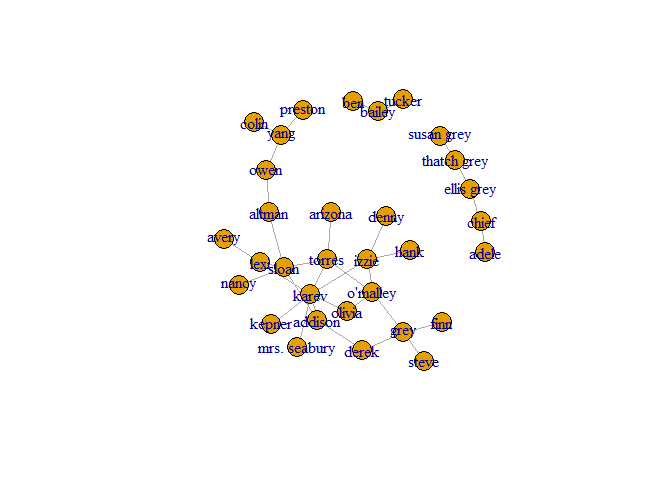
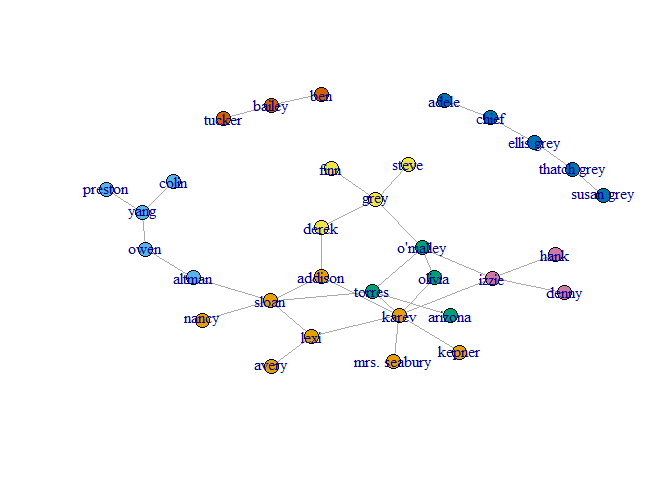
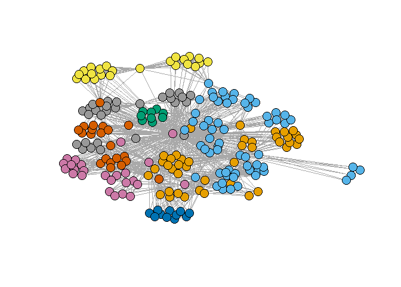

Assignment3
================
Ohad Dali
December 25, 2017

This repository included the R markdown: 1. Report.rmd - R markdown source file of this report. 2. ga\_edgelist.csv - rey Anatomy network of romance data file. 3. Report\_files - The png file for this report.

Assignment 3 - Task 1
=====================

Network Analysis of Grey Anatomy network of romance
---------------------------------------------------

### a. Centrality

Let's load the Grey Anatomy network of romance and plot the graph

``` r
library(igraph)
```

    ## Warning: package 'igraph' was built under R version 3.4.3

    ## 
    ## Attaching package: 'igraph'

    ## The following objects are masked from 'package:stats':
    ## 
    ##     decompose, spectrum

    ## The following object is masked from 'package:base':
    ## 
    ##     union

``` r
ga.data <- read.csv('ga_edgelist.csv', header = TRUE , stringsAsFactors = FALSE)
g <- graph.data.frame(ga.data,directed = F)
plot(g)
```



Now let's focus on the big component of the graph.

``` r
g_ <- delete.vertices(g, c('adele','chief','susan grey','thatch grey','ellis grey','tucker','bailey','ben'))
plot(g_)
```


#### i. By Betweeneess

We calcualte the betweeneess of each node in the new graph, and get the node with the highest betweeneess.

``` r
bet<-betweenness(g_)
bet[which.max(bet)]
```

    ##    sloan 
    ## 115.3667

Like we can see , Sloan is the actor with the highest betweeneess(115.3667)

#### ii. By Closeness

In the same way as before, we calculates the closeness of each node and get the maximum.

``` r
clo <- closeness(g_)
clo[which.max(clo)]
```

    ##     torres 
    ## 0.01754386

We can see that Torres has closeness of 0.01754386, which it the highest in the graph.

#### iii. By Eigenvector

``` r
eig <- eigen_centrality(g_)
eig$vector[which.max(eig$vector)]
```

    ## karev 
    ##     1

Karev is the actor with the highest value of eigenvector.

### b. Community Detection.

#### Girvan-Newman community detection

We will work on the whole network.

``` r
plot(g)
```


This is Top-Down Algorithm, in each round it caluclates the betweenness of each edge and remove the edges with the highest value, until there are zero edges left.

``` r
gc <- edge.betweenness.community(g)
```

We can see which actor belong to which community

``` r
memb <- membership(gc)
memb
```

    ##         lexi         owen        sloan       torres        derek 
    ##            1            2            1            3            4 
    ##        karev     o'malley         yang         grey        chief 
    ##            1            3            2            4            5 
    ##   ellis grey   susan grey       bailey        izzie       altman 
    ##            5            5            6            7            2 
    ##      arizona        colin      preston       kepner      addison 
    ##            3            2            2            1            1 
    ##        nancy       olivia mrs. seabury        adele  thatch grey 
    ##            1            3            1            5            5 
    ##       tucker         hank        denny         finn        steve 
    ##            6            7            7            4            4 
    ##          ben        avery 
    ##            6            1

Plot the graph with an unique color for each community.

``` r
plot(g, vertex.size=6, #vertex.label=NA,
     vertex.color=memb, asp=FALSE)
```



This algorithm return **7** Communities.

``` r
length(unique(memb))
```

    ## [1] 7

And the size of each community:

``` r
a <- as.data.frame(table(memb))
colnames(a) <- c("comm ID","Size")
a
```

    ##   comm ID Size
    ## 1       1    8
    ## 2       2    5
    ## 3       3    4
    ## 4       4    4
    ## 5       5    5
    ## 6       6    3
    ## 7       7    3

The modularity for each phase of this algorithm.

``` r
gc$modularity
```

    ##  [1] -0.04584775 -0.01773356  0.01081315  0.03849481  0.06617647
    ##  [6]  0.09472318  0.12326990  0.14965398  0.17560554  0.20285467
    ## [11]  0.23096886  0.25865052  0.28633218  0.31358131  0.34083045
    ## [16]  0.36894464  0.39576125  0.41479239  0.44247405  0.46712803
    ## [21]  0.49134948  0.50778547  0.52681661  0.54974048  0.57050173
    ## [26]  0.57742215  0.56098616  0.53416955  0.45804498  0.30449827

The best modularity score

``` r
max(gc$modularity)
```

    ## [1] 0.5774221

The phash (partition) with the best score

``` r
which.max(gc$modularity)
```

    ## [1] 26

#### Fastgreedy algorithm community detection

First we need to simplify the graph, because it only works with graphs with no self loops.

``` r
g <- simplify(g)
```

This is bottom-up algorithm. Let's get the communities

``` r
gc2 <- fastgreedy.community(g)
```

Let's plot the graph, now without labels

``` r
plot(g,  vertex.size=6, vertex.label=NA,
     vertex.color=membership(gc2), asp=FALSE)
```


This algorithm return **6** Communities.

``` r
memb <- membership(gc2)
length(unique(memb))
```

    ## [1] 6

And the size of each community:

``` r
a <- as.data.frame(table(memb))
colnames(a) <- c("comm ID","Size")
a
```

    ##   comm ID Size
    ## 1       1   10
    ## 2       2    5
    ## 3       3    4
    ## 4       4    5
    ## 5       5    5
    ## 6       6    3

The modularity for each phase of this algorithm.

``` r
gc2$modularity
```

    ##  [1] -0.04584775 -0.01730104  0.01124567  0.03979239  0.06790657
    ##  [6]  0.09602076  0.12413495  0.15181661  0.17949827  0.20717993
    ## [11]  0.23486159  0.26254325  0.28979239  0.31704152  0.34429066
    ## [16]  0.37110727  0.39792388  0.42430796  0.45025952  0.47621107
    ## [21]  0.49913495  0.51989619  0.53892734  0.55536332  0.57179931
    ## [26]  0.58780277  0.59472318  0.58520761  0.52422145  0.30449827

The best modularity score

``` r
max(gc2$modularity)
```

    ## [1] 0.5947232

The phash (partition) with the best score

``` r
which.max(gc2$modularity)
```

    ## [1] 27

Assignment 3 - Task 2
=====================

Network Analysis of Grey Anatomy network of romance
---------------------------------------------------

Loading the relvant packages

``` r
library(twitteR)
```

    ## Warning: package 'twitteR' was built under R version 3.4.3

``` r
library(tm)
```

    ## Warning: package 'tm' was built under R version 3.4.3

    ## Loading required package: NLP

``` r
library(httr)
```

    ## Warning: package 'httr' was built under R version 3.4.3

    ## 
    ## Attaching package: 'httr'

    ## The following object is masked from 'package:NLP':
    ## 
    ##     content

``` r
library(igraph)
```

``` r
source("twitterAuth.R")
options(httr_oauth_cache=F)
setup_twitter_oauth(consumer_key, consumer_secret, access_token, access_secret)
```

    ## [1] "Using direct authentication"

Search for 50 tweets that containes '\#IphoneX'

``` r
searchRes <- searchTwitter("#IphoneX", n=50 , lang="en")
```

It will be easy to work with a dataFrame then a list.

``` r
tweetsDf <- twListToDF(searchRes)
```

``` r
words <- strsplit(tweetsDf$text," ")
```

Each node in the graph will be a word in a tweet. Given w1,w2 node in the graph, (w1,w2) belong to the the graph iff w1 and w2 in the same tweet.

``` r
w1edge <- c()
w2edge <- c()

for(i in 1:length(words))
{
  for(word1 in words[[i]])
  {
    for(word2 in words[[i]])
    {
      if(word1!= word2)
      {
        w1edge <- c(w1edge,word1)
        w2edge <- c(w2edge,word2)
      }
    }
  }
}
```

Making the graph..

``` r
res <- cbind(from = w1edge , to = w2edge)
write.csv(res , file = "tweets.csv" , row.names = FALSE)
ga.data <- read.csv('tweets.csv', header = T)
g <- graph.data.frame(ga.data,directed = F)
plot(g, vertex.size=7, vertex.label=NA, asp=FALSE)
```


Number of nodes in the graph

``` r
length(V(g))
```

    ## [1] 196

### a. Now we will calculate Centrality :

#### i. By Betweeneess

We calcualte the betweeneess of each node in the new graph, and get the node with the highest betweeneess.

``` r
bet<-betweenness(g)
bet[which.max(bet)]
```

    ##       RT 
    ## 4519.167

#### ii. By Closeness

In the same way as before, we calculates the closeness of each node and get the maximum.

``` r
clo <- closeness(g)
clo[which.max(clo)]
```

    ##          RT 
    ## 0.003355705

#### iii. By Eigenvector

``` r
eig <- eigen_centrality(g)
eig$vector[which.max(eig$vector)]
```

    ## RT 
    ##  1

### b. Community Detection.

#### Girvan-Newman community detection

This is Top-Down Algorithm, in each round it caluclates the betweenness of each edge and remove the edges with the highest value, until there are zero edges left.

``` r
gc <- edge.betweenness.community(g)
```

Plot the graph with an unique color for each community.

``` r
memb <- membership(gc)
plot(g, vertex.size=6, vertex.label=NA,
     vertex.color=memb, asp=FALSE)
```


The number of communities

``` r
length(unique(memb))
```

    ## [1] 18

And the size of each community:

``` r
a <- as.data.frame(table(memb))
colnames(a) <- c("comm ID","Size")
a
```

    ##    comm ID Size
    ## 1        1   22
    ## 2        2   10
    ## 3        3   14
    ## 4        4   16
    ## 5        5    9
    ## 6        6   19
    ## 7        7   13
    ## 8        8   10
    ## 9        9   21
    ## 10      10   18
    ## 11      11    6
    ## 12      12    1
    ## 13      13   14
    ## 14      14    9
    ## 15      15    1
    ## 16      16    1
    ## 17      17    1
    ## 18      18   11

The modularity for each phase of this algorithm.

``` r
gc$modularity
```

    ##   [1] -0.018965586 -0.018502192 -0.017118767 -0.014161053 -0.009509694
    ##   [6] -0.003164689  0.004873960  0.014179283  0.025554428  0.038623219
    ##  [11]  0.053385654  0.069841735  0.087991461  0.107834833  0.109451154
    ##  [16]  0.121212765  0.134269301  0.148620762  0.164267149  0.181208460
    ##  [21]  0.183984998  0.187544429  0.192032440  0.197449032  0.203794203
    ##  [26]  0.211067955  0.219270286  0.228401198  0.238460690  0.249448763
    ##  [31]  0.261365415  0.274210648  0.287984461  0.302135294  0.317732860
    ##  [36]  0.334259006  0.342230399  0.351322118  0.361534162  0.361982059
    ##  [41]  0.362222564  0.362703573  0.363390646  0.364341185  0.365532227
    ##  [46]  0.366963774  0.368635826  0.370548382  0.372701443  0.375095009
    ##  [51]  0.375334169  0.375770959  0.376436712  0.377331429  0.378455110
    ##  [56]  0.379807754  0.381389362  0.383199934  0.385239470  0.387507969
    ##  [61]  0.390005433  0.392731859  0.395687250  0.398810635  0.402219944
    ##  [66]  0.405858217  0.409725454  0.413821654  0.418146818  0.418380975
    ##  [71]  0.418856055  0.423152359  0.424469394  0.425908169  0.426264872
    ##  [76]  0.426743094  0.427342837  0.428064100  0.428906883  0.429871187
    ##  [81]  0.430957011  0.432164355  0.433589798  0.435038474  0.436608670
    ##  [86]  0.436845242  0.437201694  0.437678026  0.438274238  0.438990330
    ##  [91]  0.439807284  0.440760745  0.441834086  0.443027308  0.444340410
    ##  [96]  0.445773392  0.447326255  0.448998997  0.450791620  0.452704123
    ## [101]  0.454736507  0.456888770  0.457010906  0.457255176  0.457621582
    ## [106]  0.458110123  0.458720799  0.459453611  0.460308557  0.461285639
    ## [111]  0.462384857  0.463606209  0.463728519  0.463973139  0.464340068
    ## [116]  0.464829308  0.465440857  0.466174717  0.467030886  0.468009365
    ## [121]  0.468130133  0.468371670  0.468733976  0.469217050  0.469820893
    ## [126]  0.470545505  0.471390885  0.472357033  0.473443951  0.474651636
    ## [131]  0.475980091  0.477429313  0.478999305  0.479121774  0.479366713
    ## [136]  0.479734121  0.480223998  0.480836345  0.480957113  0.481198650
    ## [141]  0.481560956  0.482044030  0.482647873  0.483372485  0.484217865
    ## [146]  0.485184013  0.486270931  0.487458116  0.488784520  0.490231693
    ## [151]  0.491799635  0.493488345  0.495297823  0.495418592  0.495661496
    ## [156]  0.496026535  0.496513709  0.497123019  0.497854463  0.498708044
    ## [161]  0.499683759  0.499806069  0.500050688  0.500417618  0.500906858
    ## [166]  0.501518407  0.502252266  0.503108435  0.504086914  0.505187703
    ## [171]  0.505309224  0.505552264  0.505916825  0.506402906  0.507010507
    ## [176]  0.507739629  0.508590270  0.509562432  0.510656114  0.297604772
    ## [181]  0.298918830  0.300354630  0.302590526  0.304259920  0.307535637
    ## [186]  0.221675377  0.222941830  0.226135296  0.226848974  0.205624227
    ## [191]  0.179216181  0.142412942  0.132540912  0.071536421  0.013422851
    ## [196]  0.000000000

The best modularity score

``` r
max(gc$modularity)
```

    ## [1] 0.5106561

The phash (partition) with the best score

``` r
which.max(gc$modularity)
```

    ## [1] 179

#### Fastgreedy algorithm community detection

First we need to simplify the graph, because it only works with graphs with no self loops.

``` r
g <- simplify(g)
```

This is bottom-up algorithm. Let's get the communities

``` r
gc2 <- fastgreedy.community(g)
```

Let's plot the graph, now without labels

``` r
plot(g,  vertex.size=6, vertex.label=NA,
     vertex.color=membership(gc2), asp=FALSE)
```



The number of Communities

``` r
memb <- membership(gc2)
length(unique(memb))
```

    ## [1] 8

And the size of each community:

``` r
a <- as.data.frame(table(memb))
colnames(a) <- c("comm ID","Size")
a
```

    ##   comm ID Size
    ## 1       1   36
    ## 2       2   17
    ## 3       3   27
    ## 4       4   31
    ## 5       5   15
    ## 6       6   19
    ## 7       7   29
    ## 8       8   22

The modularity for each phase of this algorithm.

``` r
gc2$modularity
```

    ##   [1] -6.796976e-03 -6.297055e-03 -5.297213e-03 -3.797451e-03 -1.797767e-03
    ##   [6]  7.018373e-04  3.582898e-03  6.838834e-03  1.048939e-02  1.436279e-02
    ##  [11]  1.741075e-02  1.801045e-02  1.910427e-02  2.069222e-02  2.277431e-02
    ##  [16]  2.535052e-02  2.842086e-02  3.198533e-02  3.604393e-02  4.059666e-02
    ##  [21]  4.564351e-02  5.118450e-02  5.168166e-02  5.267597e-02  5.416744e-02
    ##  [26]  5.615607e-02  5.864185e-02  6.162479e-02  6.510489e-02  6.908214e-02
    ##  [31]  7.328290e-02  7.782747e-02  7.832463e-02  7.931894e-02  8.081041e-02
    ##  [36]  8.279904e-02  8.528482e-02  8.826776e-02  9.174786e-02  9.572511e-02
    ##  [41]  1.001995e-01  1.046209e-01  1.092393e-01  1.097727e-01  1.107764e-01
    ##  [46]  1.122507e-01  1.141953e-01  1.166104e-01  1.194960e-01  1.228519e-01
    ##  [51]  1.266783e-01  1.309752e-01  1.357425e-01  1.409802e-01  1.466883e-01
    ##  [56]  1.528669e-01  1.595160e-01  1.643951e-01  1.685080e-01  1.706835e-01
    ##  [61]  1.711776e-01  1.721659e-01  1.736483e-01  1.756248e-01  1.780954e-01
    ##  [66]  1.810602e-01  1.845191e-01  1.883079e-01  1.925275e-01  1.971586e-01
    ##  [71]  2.015347e-01  2.022037e-01  2.032355e-01  2.047508e-01  2.067495e-01
    ##  [76]  2.092318e-01  2.121975e-01  2.156466e-01  2.195793e-01  2.239954e-01
    ##  [81]  2.288949e-01  2.342780e-01  2.390194e-01  2.395067e-01  2.404739e-01
    ##  [86]  2.419205e-01  2.438465e-01  2.462518e-01  2.491366e-01  2.525007e-01
    ##  [91]  2.563442e-01  2.606672e-01  2.654694e-01  2.707511e-01  2.760668e-01
    ##  [96]  2.813016e-01  2.870237e-01  2.923507e-01  2.928341e-01  2.938011e-01
    ## [101]  2.952515e-01  2.971853e-01  2.996027e-01  3.025035e-01  3.058877e-01
    ## [106]  3.097555e-01  3.141067e-01  3.185860e-01  3.233868e-01  3.238662e-01
    ## [111]  3.248250e-01  3.262316e-01  3.280932e-01  3.304098e-01  3.331815e-01
    ## [116]  3.364082e-01  3.400899e-01  3.442267e-01  3.488186e-01  3.538654e-01
    ## [121]  3.593673e-01  3.645771e-01  3.695079e-01  3.749091e-01  3.807807e-01
    ## [126]  3.871228e-01  3.939353e-01  3.944057e-01  3.953466e-01  3.967579e-01
    ## [131]  3.986397e-01  4.009918e-01  4.038145e-01  4.071075e-01  4.108710e-01
    ## [136]  4.151049e-01  4.198093e-01  4.249841e-01  4.306293e-01  4.367450e-01
    ## [141]  4.433311e-01  4.437967e-01  4.447278e-01  4.461245e-01  4.479868e-01
    ## [146]  4.503146e-01  4.531080e-01  4.563670e-01  4.600915e-01  4.642816e-01
    ## [151]  4.689372e-01  4.740585e-01  4.796453e-01  4.856976e-01  4.922156e-01
    ## [156]  4.955286e-01  4.959837e-01  4.968937e-01  4.982588e-01  5.000790e-01
    ## [161]  5.023542e-01  5.050844e-01  5.082696e-01  5.119099e-01  5.160052e-01
    ## [166]  5.205556e-01  5.255610e-01  5.310214e-01  5.369369e-01  5.433074e-01
    ## [171]  5.501329e-01  5.510448e-01  5.514883e-01  5.523752e-01  5.537056e-01
    ## [176]  5.554794e-01  5.576966e-01  5.603574e-01  5.634615e-01  5.670091e-01
    ## [181]  5.710002e-01  5.754347e-01  5.803127e-01  5.856342e-01  5.913990e-01
    ## [186]  5.976074e-01  6.042592e-01  6.113544e-01  6.114697e-01  6.080485e-01
    ## [191]  5.994760e-01  5.855998e-01  5.618422e-01  4.832566e-01  3.925977e-01
    ## [196] -5.551115e-17

The best modularity score

``` r
max(gc2$modularity)
```

    ## [1] 0.6114697

The phash (partition) with the best score

``` r
which.max(gc2$modularity)
```

    ## [1] 189
